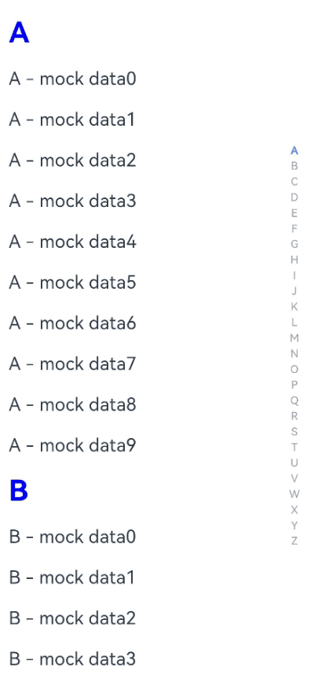

# ccIndexer

## 简介

ccIndexer 是一个为 OpenHarmony & HarmonyOS 设计，支持交互动效的索引器组件。

- 支持自定义索引数据
- 支持索引文本样式设置
- 支持悬浮索引样式设置
- 支持索引动效时长设置

## 效果



## 依赖方式

```ts
ohpm install @seagazer/ccindexer
```

## 接口能力

- IndexerView 索引器组件

  | 属性                    | 类型                    | 是否必填 | 默认值    | 说明                     |
  | ----------------------- | ----------------------- | -------- | --------- | ------------------------ |
  | textSize                | number                  | 是       | 无        | 索引文本                 |
  | selectedIndex           | number                  | 是       | 无        | 当前选中的索引值         |
  | indexArray              | Array\<string>          | 是       | 无        | 索引数据                 |
  | selectedColor        | ResourceColor           | 否       | #000000   | 当前选中的索引文本颜色   |
  | normalColor             | ResourceColor           | 否       | #ff737373 | 当前未选中的索引文本颜色 |
  | isShowFloatSelectedView | boolean                 | 否       | true      | 是否显示悬浮索引视图     |
  | floatSelectedViewSize   | number                  | 否       | 32        | 悬浮索引视图尺寸         |
  | floatSelectedTextColor  | ResourceColor           | 否       | #ffffff   | 悬浮索引视图文本颜色     |
  | floatSelectedViewColor  | ResourceColor           | 否       | #000000   | 悬浮索引视图背景颜色     |
  | animationDuration       | number                  | 否       | 300       | 交互动效时长             |
  | animationTranslation    | number                  | 否       | 32        | 索引动效便宜幅度         |
  | onIndexChanged          | (index: number) => void | 否       | null      | 索引变更回调             |

## 场景示例

```ts
import { IndexerView } from '@seagazer/ccindexer'

const DEFAULT_INDEX = ['A', 'B', 'C', 'D', 'E', 'F', 'G', 'H', 'I', 'J', 'K', 'L', 'M', 'N', 'O', 'P', 'Q', 'R', 'S', 'T', 'U', 'V', 'W', 'X', 'Y', 'Z']

@Entry
@Component
struct Index {
    @State selectedIndex: number = -1
    private scroller = new Scroller()
    private list = new Array<MockData>()

    aboutToAppear() {
        for (let i = 0; i < DEFAULT_INDEX.length; i++) {
            const groupId = DEFAULT_INDEX[i]
            let array = new Array<string>()
            for (let j = 0; j < 10; j++) {
                const data = groupId + " - mock data" + j
                array.push(data)
            }
            this.list.push(new MockData(groupId, array))
        }
    }

    @Builder
    listHeader(data: MockData) {
        ...
    }

    build() {
        Row() {
            List({ scroller: this.scroller }) {
                ForEach(this.list, (data: MockData, index: number) => {
                    ListItemGroup({ header: this.listHeader(data) }) {
                        ForEach(data.dataList, (item: string, index: number) => {
                            ListItem() {
                                Text(item)
                                    .width("100%")
                                    .height(45)
                                    .fontSize(20)
                            }
                        })
                    }
                })
            }
            .scrollBar(BarState.Off)
            .layoutWeight(1)
            .height("100%")
            .sticky(StickyStyle.Header)
            .onScrollIndex((start) => {
                this.selectedIndex = start
            })

            // 使用IndexerView组件
            IndexerView(
                {
                    indexArray: DEFAULT_INDEX, // 索引数据
                    selectedIndex: this.selectedIndex, // 当前选中索引
                    textSize: 12, // 索引文本尺寸
                    selectedColor: "#ff419ee5", // 选中索引颜色
                    normalColor: "#ffa0a0a0", // 未选中索引颜色
                    floatSelectedTextColor: "#ffffff", // 悬浮索引文本颜色
                    floatSelectedViewColor: "#ff419ee5", // 悬浮索引背景色
                    onIndexChanged: (index) => { // 索引选中监听
                        this.scroller.scrollToIndex(index)
                    }
                })
                .width(24)
                .height("60%")
        }
        .width('100%')
        .height('100%')
        .padding(16)
    }
}

class MockData {
    groupId: string
    dataList: Array<string>

    constructor(groupId: string, dataList: Array<string>) {
        this.groupId = groupId
        this.dataList = dataList
    }
}
```

更多使用场景，可以参考本库代码仓的 entry 工程：
https://github.com/seagazer/ccIndexer
